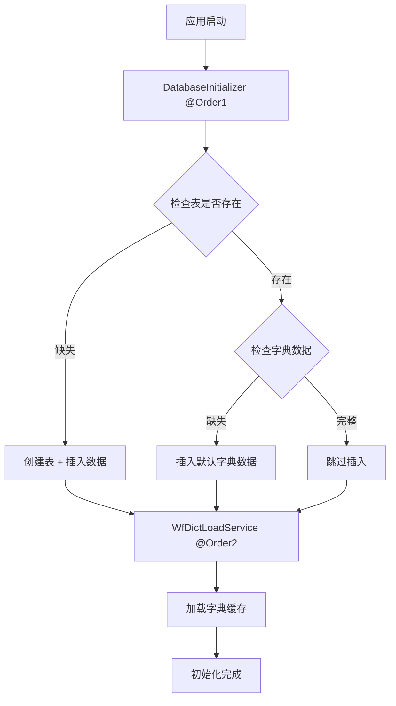

# 数据库自动初始化功能总结

## 🎯 功能概述

Workflow模块提供了智能的数据库自动初始化功能，在项目首次启动时自动创建所需的数据库表并插入必要的默认数据，解决了多项目集成时的数据库初始化问题。

## ✨ 核心特性

| 特性 | 说明 | 状态 |
|------|------|------|
| 🔍 **智能检查** | 检查表和数据是否存在 | ✅ |
| 🏗️ **自动建表** | 创建10个核心工作流表 | ✅ |
| 📊 **默认数据** | 插入字典表必要数据 | ✅ |
| 🔄 **重复安全** | 支持多次执行不报错 | ✅ |
| ⚡ **顺序控制** | 确保初始化顺序正确 | ✅ |
| ⚙️ **配置开关** | 支持启用/禁用功能 | ✅ |

## 🚀 解决的问题

### 1. **Bean初始化顺序问题**
```
问题：WfDictLoadService在数据库表创建前就尝试加载字典数据
解决：使用@Order注解控制执行顺序
```

### 2. **首次部署问题**
```
问题：其他项目导入jar包后，数据库表和数据不存在
解决：自动检查并创建表结构，插入默认数据
```

### 3. **重复执行问题**
```
问题：多次启动可能导致重复插入错误
解决：使用INSERT IGNORE语句，安全重复执行
```

## 📋 默认数据清单

### 字典表(wf_dict) - 3条记录
- 订单状态 (order_status)
- 任务状态 (task_status)  
- 审批类型 (approve_type)

### 字典项表(wf_dict_item) - 6条记录
- 待提交 (TO_BE_SUBMIT)
- 未审批 (NOT_APPROVED)
- 等待操作 (WAITING)
- 已审批 (APPROVED)
- 取消 (CANCELLED)
- 关单 (CLOSED)

## ⚡ 执行流程



## 🔧 配置方式

### 默认配置（推荐）
```yaml
workflow:
  database:
    auto-init: true      # 启用自动初始化
    fail-on-error: true  # 失败时抛出异常
```

### 生产环境配置
```yaml
workflow:
  database:
    auto-init: false     # 生产环境建议手动管理
    fail-on-error: false # 忽略初始化错误
```

## 📊 支持的表

| 表名 | 说明 | 默认数据 |
|------|------|----------|
| wf_dict | 字典定义表 | ✅ 3条 |
| wf_dict_item | 字典项表 | ✅ 6条 |
| wf_file | 文件表 | ❌ |
| wf_flow | 流程表 | ❌ |
| wf_key_user | 关键用户表 | ❌ |
| wf_order | 工作流实例表 | ❌ |
| wf_process | 流程定义表 | ❌ |
| wf_rule | 流程规则表 | ❌ |
| wf_task | 任务表 | ❌ |
| wf_task_participant | 任务参与者表 | ❌ |

## 🔍 监控和日志

### 成功日志示例
```
INFO  DatabaseInitializer : 开始检查workflow数据库表...
INFO  DatabaseInitializer : 所有workflow表已存在
INFO  DatabaseInitializer : 检测到字典数据缺失，开始插入默认字典数据...
INFO  DatabaseInitializer : 默认数据插入完成
INFO  WfDictLoadService   : 开始加载字典缓存...
INFO  WfDictLoadService   : 字典缓存加载完成
```

### 关键指标
- 表检查耗时
- 数据插入数量
- 缓存加载状态
- 错误和警告信息

## 🛠️ 故障排除

| 问题 | 原因 | 解决方案 |
|------|------|----------|
| 表创建失败 | 权限不足 | 确保数据库用户有CREATE权限 |
| 数据插入失败 | 约束冲突 | 检查主键和唯一索引 |
| 缓存加载失败 | 表不存在 | 检查表创建是否成功 |
| 启动缓慢 | SQL执行慢 | 检查数据库连接和性能 |

## 📈 性能优化

1. **批量插入**：使用批量SQL减少数据库交互
2. **连接池**：配置合适的数据库连接池
3. **索引优化**：确保表有适当的索引
4. **异步加载**：字典缓存异步加载

## 🔒 安全考虑

1. **权限控制**：最小化数据库用户权限
2. **SQL注入**：使用参数化查询
3. **敏感数据**：避免在默认数据中包含敏感信息
4. **审计日志**：记录所有初始化操作

## 📚 相关文档

- [详细配置文档](README-DATABASE-INIT.md)
- [主项目文档](../../README.md)
- [API文档](../../../server/README.md)

---

**最后更新**: 2025-01-XX  
**版本**: 1.0.0  
**维护者**: Epiroc Development Team 